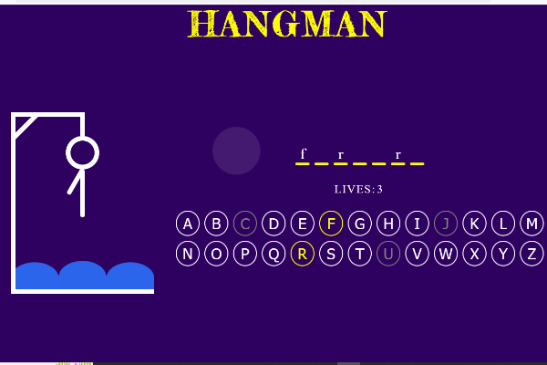

# HANGMAN GAME


## link of website
[hangman game](https://elmiriyounes.github.io/hangman)


# Hangman project



## [ ----> [View demo](https://elmiriyounes.github.io/hangman//) <---- ]

## About-the-project 🚀

This is my reproduction of the famous game "Hangman 😵" (from scratch).

Hangman is a guessing game for two or more players. One player thinks of a word, phrase or sentence and the other(s) tries to guess it by suggesting letters within a certain number of guesses.

### 🛠 Built with

* 
* 
* 

## 🎮 Explanation of the game

* Try to find the correct hidden word ✔️
* You have lives, if you keep wrong answer, you lose a live ❌
* All words are in english 💭


## ⚡️ Clone the repo

* Clone the repository:
    ```gitbash
    git clone git@github.com:ElmiriYounes/Project-Hangman-VanillaJavascript.git
    ```

* Install the packages (from the root folder):
    ```gitbash
    npm install
    ```

* Go live (from the root folder):
    ```gitbash
    npm run goLive
    ```

## 💻 Launch tests

* Jest (from the root folder):
    ```gitbash
    npm run test
    ```

* Pupeteer (from the root folder):
    ```gitbash
    npm run pupeteer
    ```


## 💬 Contact

El miri younes - elmiri.younes@hotmail.com